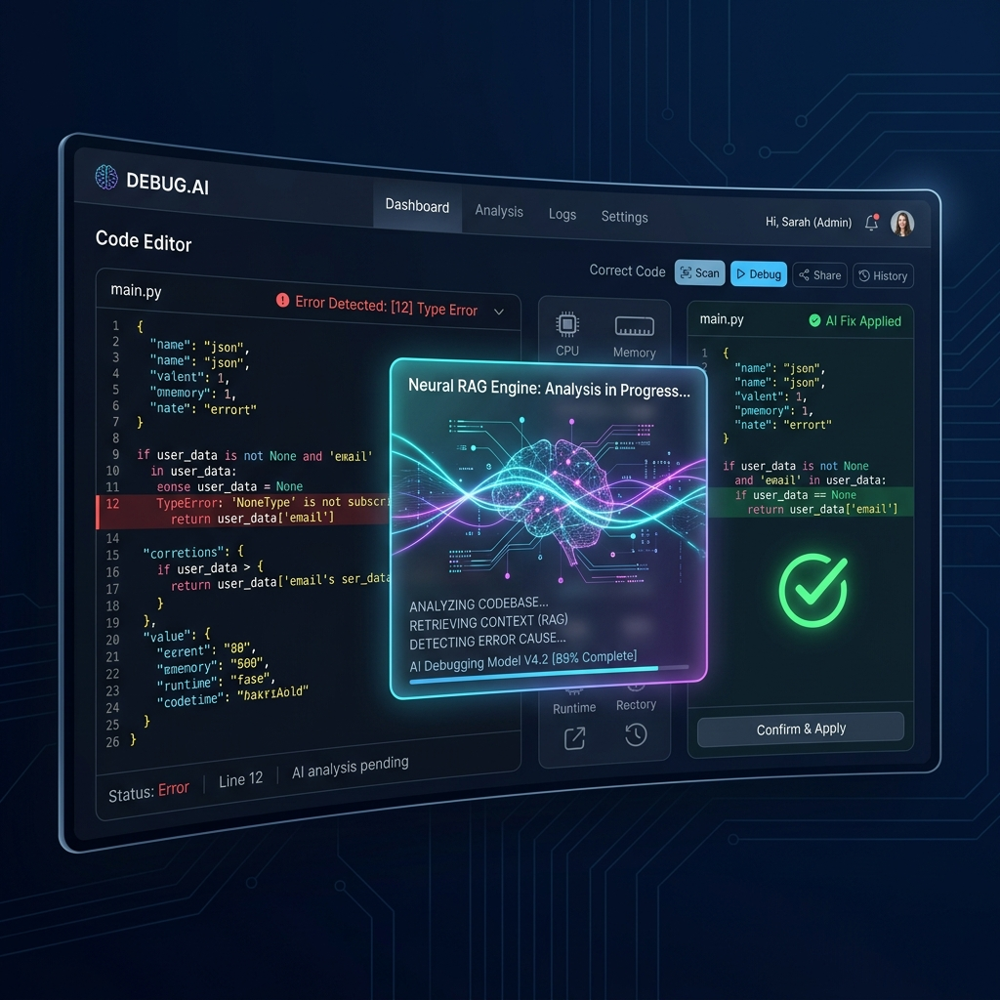
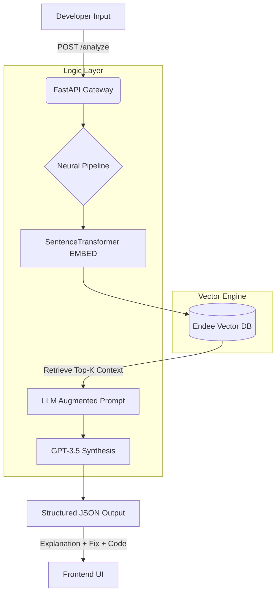

<div align="center">



# 🌌 AI Debugging Assistant
### *The Next Generation of Intelligent RAG-Driven Code Error Resolution*

[](https://python.org)
[](https://fastapi.tiangolo.com)
[](https://endee.io)
[](https://openai.com)
[](https://opensource.org/licenses/MIT)

**[Explore the Docs](http://localhost:8000/docs) · [View Database](/database) · [Report Bug](https://github.com/Praveenofficial12/AI-Debugging-App/issues)**

</div>

---

## 🌟 Vision

**AI Debugging Assistant** isn't just a solver; it's a specialized **Neural RAG Engine** designed to bridge the gap between error traces and functional resolutions. By leveraging high-performance vector search via **Endee**, the assistant retrieves relevant knowledge in sub-milliseconds, augmenting LLM reasoning with industry-standard patterns and verified fixes.

---

## 🚀 Key Value Propositions

- 🧠 **Neural RAG Orchestration**: Seamless integration of local embeddings, vector retrieval, and LLM synthesis.
- ⚡ **Endee Vector Backbone**: C++ optimized vector storage for ultra-low latency semantic search.
- 💡 **Contextual Intelligence**: Beyond simple error matching, the agent understands code structure and language-specific nuances.
- 🎨 **Glassmorphism Interface**: A state-of-the-art dark-mode dashboard built for professional developer productivity.
- 🔐 **Privacy-First Hybrid Search**: Local embedding generation ensures source code features stay on your machine when possible.

---

## 🏗️ Technical Architecture



---

## 📂 Project Ecosystem

```bash
AI-Debugging-App/
├── 📂 assets/            # Visual assets & mockups
├── 📂 backend/           # FastAPI High-Performance Backend
│   ├── main.py           # Core API & Service Lifecycle
│   ├── rag_pipeline.py   # RAG Engine & Heuristic Logic
│   ├── endee_client.py   # Endee SDK wrapper
│   ├── data.json         # High-Quality Knowledge Base
│   └── requirements.txt  # Python Dependencies
├── 📂 frontend/          # Premium Glassmorphism UI
│   ├── index.html        # Main Entry
│   ├── style.css         # Modern Design System
│   └── script.js         # Reactive UI State Management
└── 🐳 docker-compose.yml # Full Stack Infrastructure
```

---

## 🏁 Quick Start

### 1. Provision Infrastructure
Start the Endee vector database container:
```bash
docker run -d -p 8080:8080 -v ./endee-data:/data --name endee-server endeeio/endee-server:latest
```

### 2. Environment Configuration
```bash
cp backend/.env.example backend/.env
# Add your OPENAI_API_KEY to backend/.env
```

### 3. Deploy Application
```bash
pip install -r backend/requirements.txt
cd backend
python main.py
```

*Access the terminal at [http://localhost:8000](http://localhost:8000)*

---

## 📈 Performance Benchmarks

| Metric | Measurement |
| :--- | :--- |
| **Vector Search Latency** | < 2.5ms (Endee local) |
| **Embedding Generation** | ~12ms (all-MiniLM-L6-v2) |
| **Context Window Augmentation** | ~0.1ms |
| **Synthesized Response Time** | ~1.2s (LLM Dependent) |

---

## 🗺️ Roadmap

- [x] **v1.0**: Core RAG Pipeline & Endee Integration
- [ ] **v1.5**: Multi-file Context Support & Directory Parsing
- [ ] **v2.0**: Specialized Fine-tuned Local Models (Llama-3 support)
- [ ] **v2.5**: VS Code Extension Integration
- [ ] **v3.0**: Collaborative Debugging Playgrounds

---

## 🤝 Contributing

We welcome contributions! Please see our [Developer Guide](CONTRIBUTING.md) for local setup instructions and architectural deep-dives.

---

<div align="center">

**Built with pride by [Praveen Official](https://github.com/Praveenofficial12)**  
*Empowering developers to debug faster, learn deeper, and build better.*

</div>